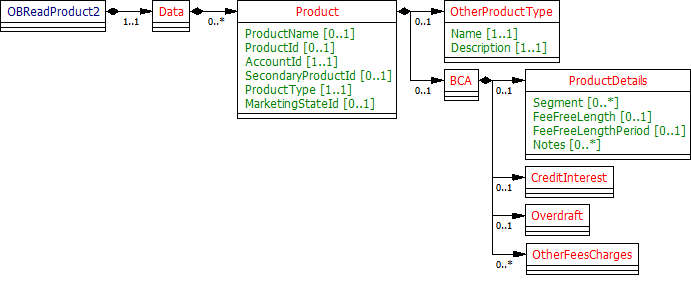

# BCA Product Data Model v3.1.2
## Overview
From the analysis:-
- Banks will provide the Open Data Product ID
- In addition to the "Open Data Product ID" link, we should focus on fields that are provided by price comparison websites today. Although overdraft rates are typically marked as "Negotiable" on PCWs, we feel that it would be useful to provide information about the actual overdraft rate(s) that the accountholder is on, even if this cannot easily be used for comparison with other products.
- The sections which are most useful for price comparison are: Fee-free periods, Credit Interest and certain sections of eligibilities where other fee charges are dependent on them and periodic fee(s).
- BCA Marketing state information is not required. 
- The eligibility criteria met when the BCA was sold is unlikely to be reliable. Hence eligibility criteria information is optional.

Further analysis required:-

- FeaturesAndBenefits: Further analysis is required to check whether feature and benefits section is needed.

### Fields to include in BCA Product
| Product Section |Fields to be included |
| --- |--- |
| BCA (We will rename this "Product and merge BCA and CoreProduct attributes) |Name ProductType ("BCA") Product Segment (e.g. "Startup","Switcher" ) Open Data Product ID (Mandatory, if product info is available on Open Data BCA API) Fee-free period |
| CoreProduct |**None** - Will be merged in to new “Product” section. |
| BCAMarketingState |**None** - Sections will only include current state information, so this section is not required. |
| CreditInterest |TierBandSet fields (excluding credit interest eligibility). All TierBand fields **Note: Only current state credit interest information is required. Where the interest rate(s) have been negotiated, the actual rates applied to the account should be provided.** |
| Overdraft |All TierBandSet fields (including OverdraftFeesAndCharges) All TierBand fields (including OverdraftFeesAndCharges). **Note: Only current state information is required. Where the overdraft rate(s) have been negotiated, the actual rates applied to the account should be provided.** |
| Eligibility |**None** - Whether an organisation is eligible for other products cannot be determined by looking at existing product eligibility e.g., criteria for a startup can vary from bank to bank. |
| FeaturesAndBenefits |**None** - The value of a particular feature and benefit to an accountholder is dependent on their use of that benefit and whether they met the eligibility criteria. Features & benefits are less significant in the BCA market than the PCA. |
| OtherFeesAndCharges |See Notes below |

Notes:
- With BCA, there are substantially more other fees & charges than are applicable to PCA account holders.
- Prior to OBIE being formed, the CMA asked the 9 banks to provide a set of fees & charges that would allow for a comparison between banks, the results of which are documented in the [Business current account and personal current account pricing analysis](https://assets.digital.cabinet-office.gov.uk/media/574470efe5274a0375000006/update_on_pca_pricing_working_paper.pdf). The comparison included the following Fee Types(Please see the attached codelist file), which we think are relevant, all of which are domestic transactions. As well as fee comparison information provided by the banks to the CMA9, there are tariff comparison calculators provided by some of the banks that allow a BCA holder the ability to determine which bank product would provide them with the lowest set of charges.
-  **Electronic:**  Auto credit, Bill payment, Debit card payment, Direct debit, Standing Order
-  **Branch/Other:** Pay in (Counter), Deposit (Cheque), Issue (Cheque),  Withdrawal (Counter), Cash In, Cash Out (Counter), Cash Out (ATM)
- However, our analysis is that the basket of fees is a weighted average provided as a one-off activity and it would be difficult for the banks to  supply fees/charges for these business activities in a real time API. This is due to banks charging fees at different levels of granularity today and fee standardisation being required. Although comparative pricing is highlighted as a key driver of the Open Banking initiative, without fee standardisation, the complexity of comparing fees is likely to deter customers from considering switching.
-  **We conclude, that as with PCA, the periodic fee is the most common "Other" fee and charge that BCA price comparison websites provide today.** 
- Banks will provide the Open Data Product ID.
- In addition to the "Open Data Product ID" link, we should focus on fields that are provided by price comparison websites today. Although overdraft rates are typically marked as "Negotiable" on PCWs, we feel that it would be useful to provide information about the actual overdraft rate(s) that the accountholder is on, even if this cannot easily be used for comparison with other products.
- The sections which are most useful for price comparison for Fee-free periods, Credit Interest and certain section of eligibilities where other fee charges are dependent on them and periodic fee(s) .
- BCA Marketing state information is not required. 
- Eligibility criteria met when BCA was sold is unlikely to be reliable. Hence eligibility criteria information is optional.

### Changes from the OpenData Model
#### No Eligibility and FeaturesAndBenefits
- Eligibility and FeaturesAndBenefits sections are removed from the Account Info section as information related to them might not be easily available. 
-  **Unlike PCA, there is no requirement to publish aMaximumMonthlyCharge, so Monthly Charge field has been omitted. In the BCA On Sale Product Data API, There were two fields**  **MonthlyCharge and IncludedInMonthlyChargeIndicator(OtherFeesAndCharges section). Both of these fields have been removed from this specification.** 

